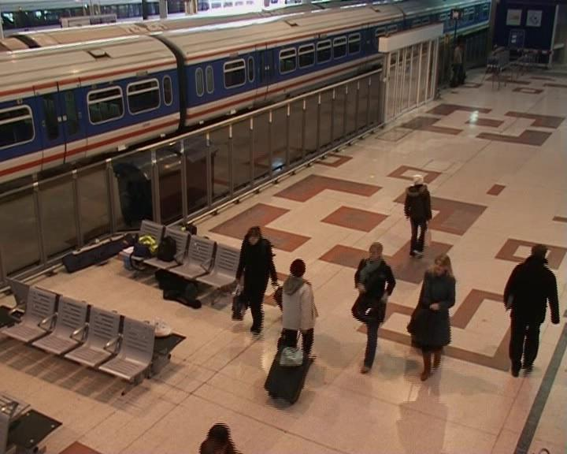
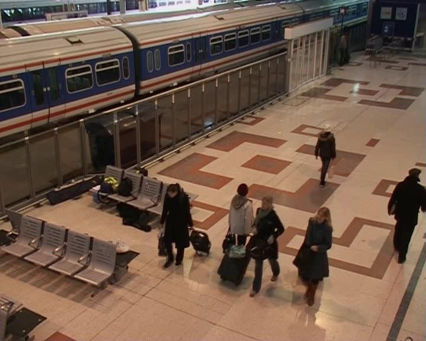
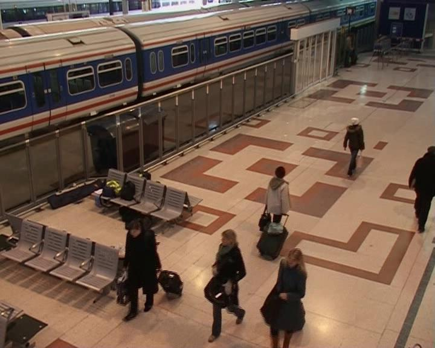
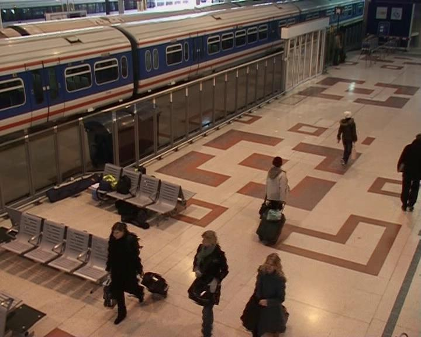
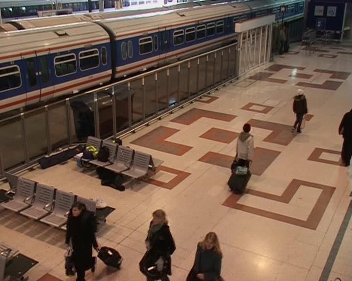
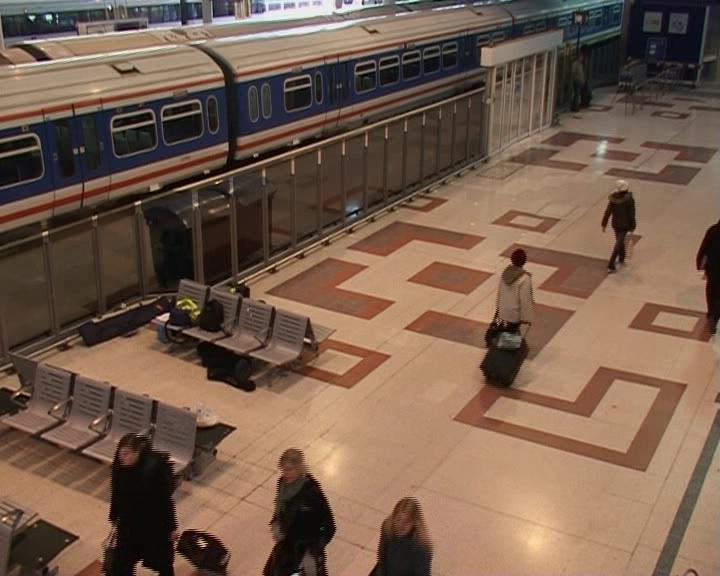

# ShuffledVideoSorter
Given a folder of shuffled images from a video this project attempts to reorder them using deep learning.

The flow of the project is quite simple: read the images, apply background substraction, apply an already trained CNN to obtain the feature map, select the first image and find the next one using the L2 distance (or cosine) with respect to the feature map, do the same until you run out of images.

To run the pipeline run main.py with two arguments "input folder" and "output folder".

The first 11 sorted images given by the pipeline:

